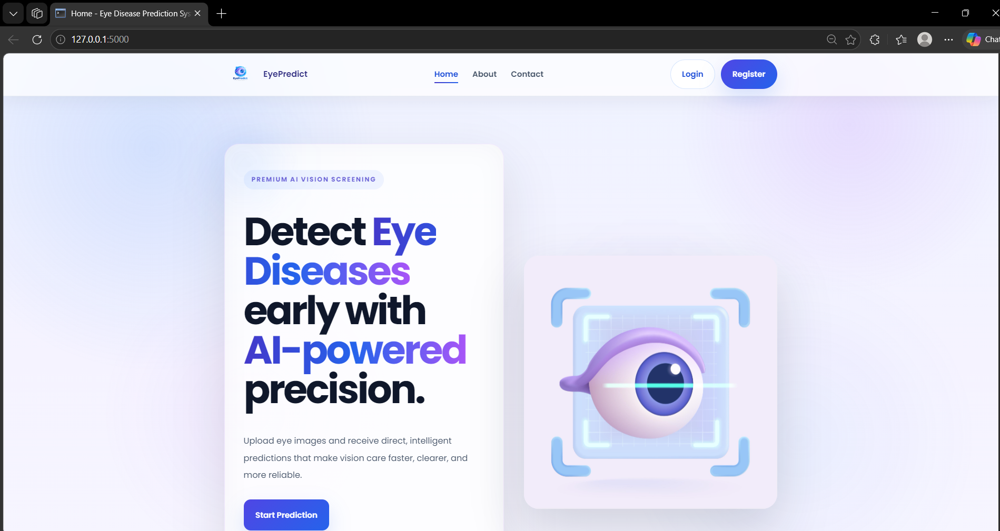
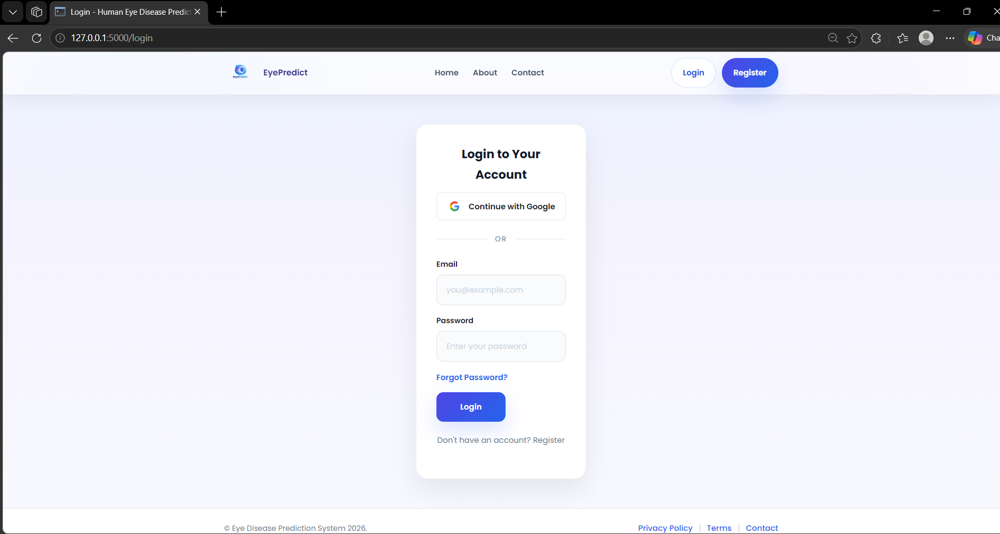
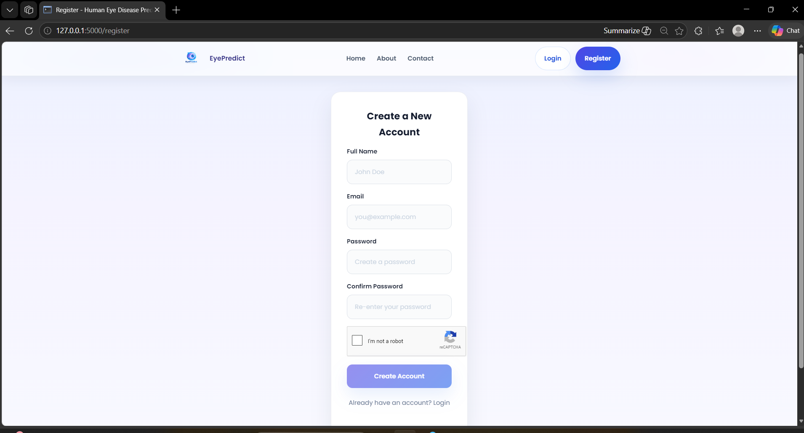
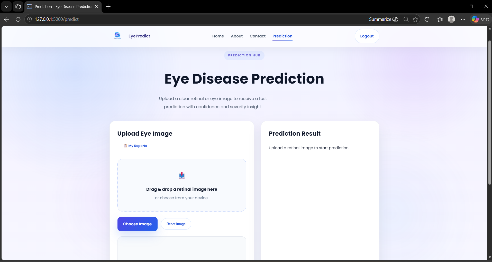
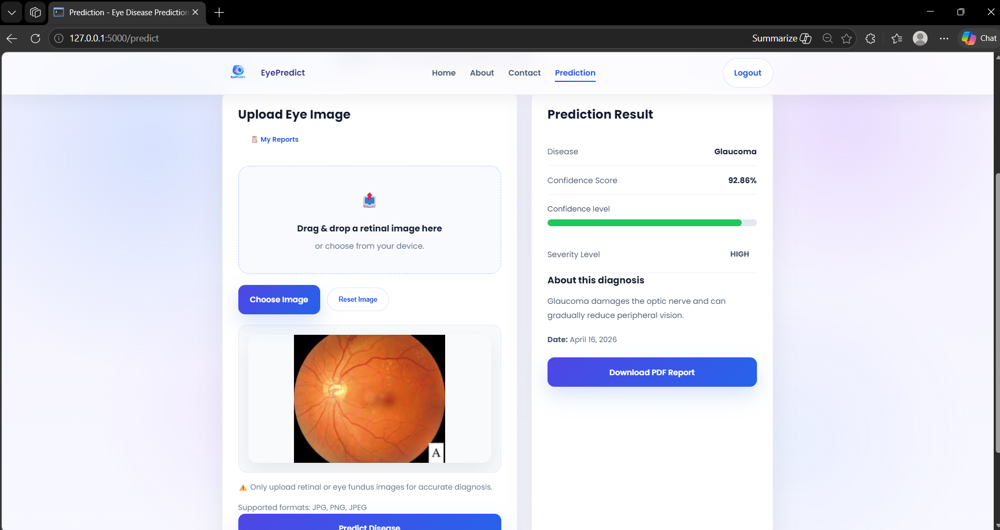
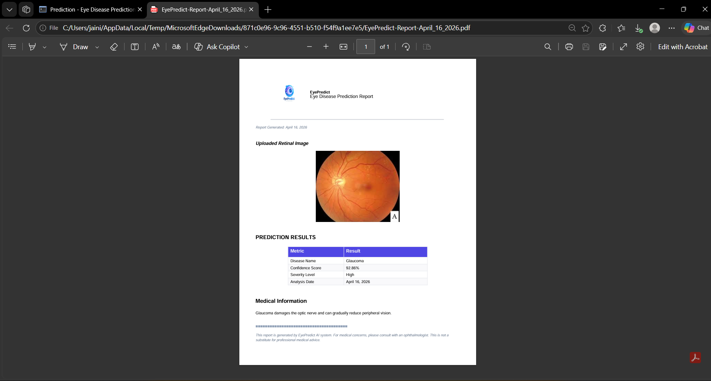

# Human Eye Disease Detection System

An AI-powered web application that detects eye diseases from retinal images using a deep learning model. The system provides real-time predictions, confidence scores, and generates a downloadable report.

---

## Features

* Upload retinal images for disease prediction
* Deep learning-based classification using MobileNetV2
* Confidence score and severity level display
* Downloadable PDF report
* User authentication (Login/Register with OTP verification)
* Responsive and modern UI

---

## Tech Stack

* Frontend: HTML, CSS, JavaScript
* Backend: Flask (Python)
* Machine Learning: TensorFlow / Keras
* Database: SQLite
* Libraries: NumPy, OpenCV
* Deployment: Render

---

## Model Details

* Model file: `eye_disease_final_model.h5`
* Architecture: MobileNetV2 (Transfer Learning)
* Type: Image Classification Model
* Dataset: Kaggle Eye Disease Dataset

### Model Performance

* Accuracy: ~89%
* Loss Function: Categorical Crossentropy
* Optimizer: Adam

---

## Backend Summary

The backend is developed using Flask and handles image input, preprocessing, model prediction, and response generation.

* Receives user-uploaded eye image
* Processes and converts image into model-compatible format
* Loads trained MobileNetV2 model (.h5)
* Predicts disease class and confidence score
* Returns result to frontend

The system is optimized for fast and efficient predictions.

---

## Workflow

User Image → Image Preprocessing → MobileNetV2 Model → Prediction → Result Display

---

## Model Working Algorithm

1. Load Kaggle eye disease dataset
2. Perform preprocessing (resize, normalization)
3. Split dataset (train, validation, test)
4. Load MobileNetV2 pre-trained model
5. Freeze base layers
6. Add custom classification layers
7. Compile using Adam optimizer and categorical crossentropy
8. Train model
9. Validate performance
10. Test accuracy
11. Save model (.h5)
12. Load model in Flask
13. Accept user image
14. Preprocess image
15. Predict disease
16. Return result

---

## Image Processing Algorithm

* Accept input image
* Resize to 224 × 224
* Convert to NumPy array
* Normalize pixel values (0–1)
* Add batch dimension
* Pass to model
* Receive prediction output

---

## Training Algorithm Summary

* Import TensorFlow, Keras, NumPy
* Load dataset from Kaggle
* Apply data augmentation
* Initialize MobileNetV2
* Add Dense and Dropout layers
* Compile using Adam optimizer
* Train model over epochs
* Monitor validation accuracy
* Apply early stopping
* Save model (.h5)

---

## Prediction Algorithm

* Load trained model
* Accept input image
* Preprocess image
* Pass to model
* Generate probability scores
* Select highest probability class
* Return predicted label
* Display confidence score

---

## Project Structure

```bash
├── app/
├── static/
├── templates/
├── screenshots/
│   ├── home.png
│   ├── login.png
│   ├── register.png
│   ├── upload.png
│   ├── result.png
│   └── pdf_report.png
├── app.py
├── config.py
├── requirements.txt
├── eye_disease_final_model.h5
└── README.md
```

---

## Screenshots

### Home Page



### Login Page



### Register Page



### Prediction Dashboard



### Prediction Result



### PDF Report



---

## Additional Features

* Email verification with OTP
* Resend OTP functionality
* About page
* Contact page
* Secure authentication system

---

## Installation and Setup

### Clone repository

```bash
git https://github.com/ishika-jain-analytics/human_eye-new.git
cd human_eye-new
```

### Create virtual environment

```bash
python -m venv venv
venv\Scripts\activate
```

### Install dependencies

```bash
pip install -r requirements.txt
```

### Run application

```bash
python app.py
```

Open in browser:
http://127.0.0.1:5000/

---

## Environment Variables

Create `.env` file:

```env
SECRET_KEY=your_secret_key_here
```

---

## Deployment

Deploy on Render by connecting GitHub repository and setting environment variables.

---

## Future Improvements

* Improve model accuracy
* Add more disease classes
* Use cloud database
* Add user history dashboard

---

## Author

Ishika Jain
Bhumi Jain
BTech Data Science Student

---

## Disclaimer

This project is for educational purposes only and should not be used as a substitute for professional medical advice.
